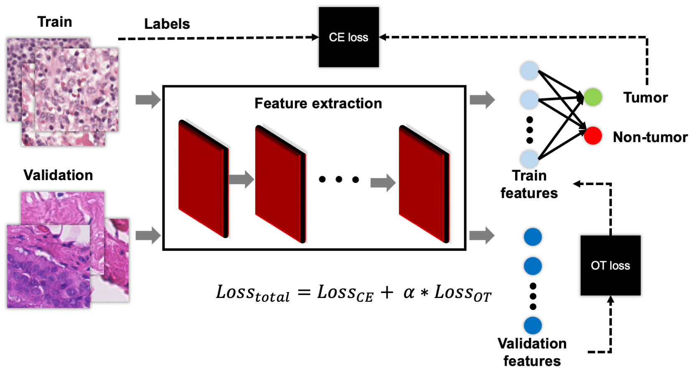

# unsupervised domain adaptation using optimal transport ([Paper])(https://arxiv.org/abs/2303.02241v1)


This repository contains the code for Domain Adaptation using Optimal Transport for Invariant Learning on Histopathology Datasets. Licensing details can be found in the license.txt file.


## Requirements
- This source has been tested on Ubuntu 18.04.4 
- CPU or NVIDIA GPU 
- Python 3.7.1 
- CUDA 10.1
- PyTorch 1.3

## Python Dependencies
- numpy
- torch
- torchvision
- geomloss

## Dataset
The data used for training is [camelyon17-wilds](https://github.com/p-lambda/wilds). 
For installation use:
```bash
pip install wilds
```
For downloading cameyon17 use:
```bash
from wilds import get_dataset
dataset = get_dataset(dataset="camelyon17", download=True)
```
More information can be found [here](https://github.com/p-lambda/wilds)

## Training and evaluation
- To train OT model:
```bash
python train_OT.py --exp 0 --Lambda .1 --batch_size 128
```

- To train DANN model:
```bash
python train_DANN.py --exp 0  --batch_size 128
```

The evaluation results will be saved in "val_res".

